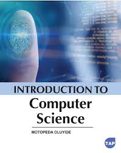

# CS3990 Assignment 5 -- Midterm Cheat Sheet
## CSS Advanced: Responsive Layouts Using CSS Grid (No Media Queries!)

---

## What This Assignment Was About

The goal was to build a **responsive landing page** for NWP Computer Science programs using **CSS Grid** -- and the big constraint was **NO `@media` queries allowed**. Everything had to adapt to different screen sizes purely through CSS Grid's built-in responsive features (like `auto-fit` and `minmax()`).

The page has four sections:
1. **Header** -- full-width hero with a background image, title, description, and a CTA button
2. **Cards section** -- three program cards, each with an overlay title on an image, description text, and a link
3. **Gallery section** -- four course thumbnails with hover effects (zoom + reveal hidden info)
4. **Footer** -- two items pushed to opposite sides with flexbox

**Key assignment requirements:**
- Responsive without `@media` rules -- use `repeat(auto-fit, minmax(...))` instead
- Images have top-left and top-right corners rounded
- Hover on links changes background color and text color
- Clicking "Browse NWP programs" anchor-links to the cards section
- Hovering over a course image scales it up by ~1.1-1.2x
- Hovering over a course reveals hidden credit/hours info below the title
- Footer has copyright on the left, credit text on the right

---

## Section 1: The Universal Reset (`*` selector)

```css
* {
  margin: 0;
  padding: 0;
  box-sizing: border-box;
}
```

### What each property does:

| Property | What | Why |
|---|---|---|
| `margin: 0` | Removes default outer spacing from ALL elements | Browsers add default margins to `h1`, `p`, `body`, etc. This gives you a clean slate. |
| `padding: 0` | Removes default inner spacing from ALL elements | Same idea -- no surprise spacing. |
| `box-sizing: border-box` | Makes `width` include padding and border | Without this, if you set `width: 100%` and add `padding: 20px`, the element becomes wider than 100%. With `border-box`, padding is included INSIDE the width. |

### Why this matters:
Without the reset, every browser adds its own default styles. Your layout will look different in Chrome vs Firefox vs Safari. The reset ensures you start from zero everywhere.

### Selector explained:
- `*` is the **universal selector** -- it matches EVERY element on the page. It's the broadest possible selector.

### Reusable pattern -- always start your CSS with this:
```css
* {
  margin: 0;
  padding: 0;
  box-sizing: border-box;
}
```

---

## Section 2: The Header (CSS Grid + Background Image)

### HTML Structure
```html
<header>
  <h1>Computer Science is your dream?</h1>
  <div>
    <p>Our leading-edge programs offer practical connections...</p>
    <a href="#cards" class="button">Browse NWP programs</a>
  </div>
</header>
```

**Key HTML points:**
- `<header>` is a semantic element (tells the browser/screen readers "this is the page header")
- The `<a href="#cards">` is an **anchor link** -- clicking it scrolls to the element with `id="cards"`. This is how the "Browse NWP programs" button jumps to the cards.
- The `class="button"` on the `<a>` tag lets us style a link to LOOK like a button

### CSS Breakdown

```css
header {
  display: grid;
  grid-template-columns: repeat(auto-fit, minmax(300px, 1fr));
  background: url(Images/headerPic.png);
  background-repeat: no-repeat;
  background-size: cover;
  background-position: center;
  padding: 40px;
}
```

| Property | What It Does | Why It's Used Here |
|---|---|---|
| `display: grid` | Turns the header into a CSS Grid container | Allows the two children (h1 and div) to sit side-by-side on wide screens |
| `grid-template-columns: repeat(auto-fit, minmax(300px, 1fr))` | Creates columns that are at least 300px wide, and as many as will fit | **THIS IS THE KEY TO RESPONSIVE WITHOUT MEDIA QUERIES.** On wide screens, both children sit side-by-side. On narrow screens (<600px), each child takes full width and they stack. |
| `background: url(Images/headerPic.png)` | Sets a background image | The header has a tech-themed background photo |
| `background-repeat: no-repeat` | Prevents the image from tiling/repeating | Without this, small images would repeat like wallpaper |
| `background-size: cover` | Scales the image to cover the entire element | The image will fill the header no matter what size. Some parts may get cropped, but there will be no gaps. |
| `background-position: center` | Centers the background image | When the image gets cropped (from `cover`), it crops from the edges, keeping the center visible |
| `padding: 40px` | Adds 40px of space inside the header on all sides | Keeps text from touching the edges |

### Deep dive: `repeat(auto-fit, minmax(300px, 1fr))`

This is the most important pattern in the whole assignment. Let's break it down piece by piece:

- **`repeat(...)`** -- creates multiple columns using a pattern
- **`auto-fit`** -- "make as many columns as will fit in the available space"
- **`minmax(300px, 1fr)`** -- each column is at least 300px wide, but can grow to fill remaining space (`1fr` = one fraction of leftover space)

**How it responds:**
- Window is 1200px wide? Two columns of ~600px each (both > 300px minimum)
- Window is 500px wide? Only one 300px+ column fits, so items stack vertically
- Window is 900px wide? Two columns of ~450px each

**This replaces media queries!** Instead of writing `@media (max-width: 768px) { ... }`, the grid just figures it out automatically.

### Header text styling

```css
header h1 {
  text-align: left;
  margin-top: 20px;
  color: purple;
}

header p {
  text-align: left;
  color: white;
  font-size: 20px;
}
```

| Property | What | Why |
|---|---|---|
| `text-align: left` | Aligns text to the left | Ensures left alignment (some parent containers might center things) |
| `color: purple` | Sets the h1 text color to purple | Stands out against the dark background image |
| `color: white` | Sets the paragraph text color to white | Readable against the dark background |
| `font-size: 20px` | Makes paragraph text 20px | Slightly larger than default for readability |
| `margin-top: 20px` | Pushes h1 down 20px from the top | Adds breathing room |

### Selectors explained:
- `header h1` -- this is a **descendant combinator**. It selects any `h1` that is inside a `header` element. It does NOT affect h1 elements elsewhere on the page.
- `header p` -- same pattern, targets only `<p>` elements inside `<header>`.

**How to reuse:** Anytime you need a full-width hero with a background image and responsive side-by-side content, grab this pattern and swap out the details:
```css
.hero-section {
  display: grid;
  grid-template-columns: repeat(auto-fit, minmax(300px, 1fr));
  background: url(your-image.jpg);
  background-size: cover;
  background-position: center;
  background-repeat: no-repeat;
  padding: 40px;
}
```
Change the `minmax(300px, ...)` value to control when the two halves stack. Smaller minimum = stays side-by-side longer. Larger minimum = stacks sooner.

---

## Section 3: The Button (Styled Link + Hover Effect)

### CSS Breakdown

```css
.button {
  color: white;
  text-decoration: none;
  display: inline-block;
  background-color: gold;
  margin-top: 5px;
  padding: 10px;
  margin: 10px;
}

.button:hover {
  color: black;
  background-color: rgba(255, 215, 0, 0.5);
}
```

| Property | What It Does | Why It's Used Here |
|---|---|---|
| `color: white` | Makes link text white | Default link color is blue with underline -- we want a button look |
| `text-decoration: none` | Removes the underline from the link | Links have underlines by default; buttons don't |
| `display: inline-block` | Makes the `<a>` tag accept width/height and padding like a block, but still flows inline | By default, `<a>` is inline, so padding/margin behave weirdly. `inline-block` fixes that. |
| `background-color: gold` | Gives it a gold/yellow background | Makes it look like a button |
| `padding: 10px` | Adds 10px of space inside on all sides | Makes the "button" bigger and more clickable |
| `margin: 10px` | Adds 10px of space outside on all sides | Separates it from surrounding elements |

### Hover pseudo-class:

```css
.button:hover {
  color: black;
  background-color: rgba(255, 215, 0, 0.5);
}
```

- **`:hover`** is a **pseudo-class** -- it applies styles only when the user's mouse is over the element
- `rgba(255, 215, 0, 0.5)` -- this is gold at 50% opacity. The `a` stands for "alpha" (transparency). `0.5` = 50% see-through.
- The text changes from white to black so it stays readable against the lighter background

### Selector explained:
- `.button` -- the dot means it's a **class selector**. It matches any element with `class="button"`.
- `.button:hover` -- combines the class selector with the `:hover` pseudo-class.

### Why `class` and not `id`?
Both the header link and the card links use `class="button"`. Classes can be reused on multiple elements. IDs (`id="something"`) must be unique -- only one element per page can have a given ID. Use classes for styling, IDs for unique identification (like anchor links).

### Reusable pattern -- styled link that looks like a button:
```css
.button {
  color: white;
  text-decoration: none;
  display: inline-block;
  background-color: gold;
  padding: 10px 20px;
}
.button:hover {
  background-color: rgba(255, 215, 0, 0.5);
  color: black;
}
```

---

## Section 4: The Cards Section (Responsive Grid + Image Overlay)

### HTML Structure
```html
<section class="cards" id="cards">
  <div class="card">
    <div class="image-wrapper">
      
      <h2>Computer Systems Technology (Certificate)</h2>
    </div>
    <p>Description text...</p>
    <a href="..." class="button">Visit NWP website</a>
  </div>
  <!-- more cards... -->
</section>
```

**Key HTML points:**
- `<section>` is semantic -- means "a thematic grouping of content"
- `id="cards"` is what the header's `<a href="#cards">` links to (anchor target)
- The `<h2>` is INSIDE the `image-wrapper` div alongside the `` -- this is what lets us overlay the title on the image using `position: absolute`
- Each card is a `<div class="card">` -- they repeat the same structure (image-wrapper, paragraph, link)

### Cards container

```css
.cards {
  display: grid;
  grid-template-columns: repeat(auto-fit, minmax(250px, 1fr));
  gap: 15px;
  padding: 15px;
}
```

| Property | What | Why |
|---|---|---|
| `display: grid` | Makes the section a grid container | Allows the 3 cards to sit side-by-side |
| `grid-template-columns: repeat(auto-fit, minmax(250px, 1fr))` | Responsive columns, min 250px each | Same pattern as the header! On wide screens = 3 columns. On medium = 2. On narrow = 1. All automatic. |
| `gap: 15px` | Adds 15px space between grid items | Cleaner than using margins on each card. `gap` only adds space BETWEEN items, not on the outer edges. |
| `padding: 15px` | Adds 15px inside the section | Creates space between the cards and the edge of the page |

### Individual card

```css
.card {
  color: grey;
  border: 3px solid rgb(197, 197, 197);
  border-radius: 5px 5px 5px 5px;
  overflow: hidden;
}
```

| Property | What | Why |
|---|---|---|
| `color: grey` | Sets default text color to grey | The description text appears grey |
| `border: 3px solid rgb(197, 197, 197)` | Adds a light grey border around each card | Defines the card boundary visually. `rgb(197,197,197)` is a light grey. |
| `border-radius: 5px 5px 5px 5px` | Rounds all four corners by 5px | Gives the card a slightly rounded look. Order: top-left, top-right, bottom-right, bottom-left. |
| `overflow: hidden` | Hides anything that sticks out beyond the card's boundaries | Without this, the image corners would poke out past the rounded border-radius. This clips them. |

### The image wrapper (position: relative container)

```css
.image-wrapper {
  position: relative;
  height: 200px;
  overflow: hidden;
}
```

| Property | What | Why |
|---|---|---|
| `position: relative` | Makes this the reference point for absolutely-positioned children | The h2 overlay uses `position: absolute`, which positions relative to the nearest `position: relative` ancestor. Without this, it would position relative to the whole page. |
| `height: 200px` | Fixed height of 200px | Ensures all card images are the same height |
| `overflow: hidden` | Clips anything that extends beyond 200px | If the image is taller, the excess gets hidden |

### Card image

```css
.card img {
  width: 100%;
  height: 100%;
  object-fit: cover;
  border-radius: 9px 9px 0 0;
}
```

| Property | What | Why |
|---|---|---|
| `width: 100%` | Image fills the full width of its container | Responsive -- image stretches/shrinks with the card |
| `height: 100%` | Image fills the full height of the wrapper (200px) | Together with width:100%, the image fills the entire wrapper |
| `object-fit: cover` | Scales the image to cover the container, cropping if needed | Without this, setting both width and height to 100% would STRETCH the image and distort it. `cover` maintains aspect ratio and crops the excess. |
| `border-radius: 9px 9px 0 0` | Rounds top-left and top-right corners, bottom stays square | **Assignment requirement!** Images must have rounded top corners only. Values: top-left(9px) top-right(9px) bottom-right(0) bottom-left(0). |

### Card h2 overlay (position: absolute)

```css
.card h2 {
  position: absolute;
  bottom: 0;
  left: 0;
  width: 100%;
  color: white;
  background-color: rgba(0, 0, 0, 0.5);
  padding: 10px;
  font-weight: bold;
}
```

This is a **text overlay on an image** pattern -- very common and very likely to show up on an exam.

| Property | What | Why |
|---|---|---|
| `position: absolute` | Removes the element from normal flow and positions it relative to the nearest `position: relative` ancestor | The h2 needs to sit ON TOP of the image, not below it. `absolute` lets it float over the image. |
| `bottom: 0` | Pins it to the bottom of the wrapper | The title appears at the bottom of the image |
| `left: 0` | Pins it to the left edge | Starts from the left side |
| `width: 100%` | Stretches across the full width | The dark overlay spans the entire image width |
| `color: white` | White text | Readable against the dark overlay |
| `background-color: rgba(0, 0, 0, 0.5)` | Semi-transparent black background | Creates a dark overlay so white text is readable over any image. `rgba(0,0,0,0.5)` = black at 50% opacity. |
| `padding: 10px` | Space inside the overlay | Text doesn't touch the edges |
| `font-weight: bold` | Bold text | Headings should be bold |

### Card paragraph

```css
.card p {
  padding: 10px;
}
```

Simple -- just adds 10px padding around the description text so it doesn't touch the card edges.

### Selector types used in this section:
- `.cards` -- class selector
- `.card` -- class selector
- `.image-wrapper` -- class selector
- `.card img` -- **descendant combinator** (img inside .card)
- `.card h2` -- descendant combinator (h2 inside .card)
- `.card p` -- descendant combinator (p inside .card)

**How to reuse:** This whole card pattern works for any "grid of content boxes" scenario -- product listings, team member profiles, blog post previews, etc. Swap out the content and adjust the minimum column width:
```css
/* Container: change minmax to control columns */
.products {
  display: grid;
  grid-template-columns: repeat(auto-fit, minmax(280px, 1fr));
  gap: 20px;
}
/* Card: border + rounded corners + overflow clip */
.product {
  border: 2px solid #ddd;
  border-radius: 8px;
  overflow: hidden;
}
/* Image overlay: wrapper = relative, text = absolute */
.product .image-wrapper { position: relative; height: 200px; overflow: hidden; }
.product img { width: 100%; height: 100%; object-fit: cover; }
.product h2 {
  position: absolute; bottom: 0; left: 0; width: 100%;
  background: rgba(0,0,0,0.5); color: white; padding: 10px;
}
```
The key combo is `position: relative` on the wrapper + `position: absolute` on the overlay. That works everywhere.

---

## Section 5: The Course Gallery (Grid + Hover Animations)

### HTML Structure
```html
<section class="gallery">
  <div class="course">
    <div class="course-img-wrapper">
      
    </div>
    <p class="course-title">Introduction to Computing Science</p>
    <p class="course-info">Credits: 3<br />Total Hours: 60</p>
  </div>
  <!-- more courses... -->
</section>
```

**Key HTML points:**
- `<br />` creates a line break inside the paragraph -- "Credits: 3" on one line, "Total Hours: 60" on the next
- Each course has a wrapper div around its image (for `overflow: hidden` on hover zoom)
- The `.course-info` paragraph is initially hidden (opacity: 0) and revealed on hover

### Gallery container

```css
.gallery {
  display: grid;
  grid-template-columns: repeat(auto-fit, minmax(150px, 1fr));
  gap: 20px;
  padding: 30px;
  margin-top: 20px;
}
```

Same responsive grid pattern, but with a smaller minimum width (150px instead of 250px). This means more items can fit per row. On a wide screen, all 4 courses sit in one row. On narrow screens, they wrap to 2x2 or stack vertically.

### Course image wrapper

```css
.course-img-wrapper {
  overflow: hidden;
  border-radius: 9px 9px 0 0;
}
```

| Property | What | Why |
|---|---|---|
| `overflow: hidden` | Clips content that extends beyond the wrapper | When the image scales up on hover (transform: scale), the zoomed-in parts get clipped instead of overflowing |
| `border-radius: 9px 9px 0 0` | Rounds top-left and top-right corners | **Assignment requirement.** The wrapper needs the radius so the rounded corners are maintained even when the image scales up. |

### Course image

```css
.course img {
  width: 100%;
  aspect-ratio: 1 / 1;
  object-fit: contain;
  border-radius: 9px 9px 0 0;
  background-color: #f0f0f0;
}
```

| Property | What | Why |
|---|---|---|
| `width: 100%` | Image fills full width of container | Responsive sizing |
| `aspect-ratio: 1 / 1` | Forces a perfect square | All course images appear as squares regardless of original dimensions. The `1 / 1` means width:height = 1:1. |
| `object-fit: contain` | Scales the image to fit entirely inside the box (no cropping) | Unlike `cover` which crops, `contain` shows the whole image. Any empty space is filled by the background color. |
| `border-radius: 9px 9px 0 0` | Rounded top corners on the image itself | Assignment requirement for rounded top corners |
| `background-color: #f0f0f0` | Light grey background | Fills the empty space when `object-fit: contain` doesn't cover the full area |

### `object-fit: cover` vs `object-fit: contain` -- know the difference!

- **`cover`** -- image fills the entire box, cropping excess. Used on card images where we want full coverage.
- **`contain`** -- image fits entirely inside the box, showing all content. May leave empty space. Used on course images where we want to see the full book cover.

### Course title and info

```css
.course-title {
  font-weight: bold;
  text-align: center;
  padding: 10px;
}

.course-info {
  text-align: center;
  opacity: 0;
  transition: opacity 0.3s;
  font-size: 0.85rem;
  color: black;
  margin-top: 4px;
}
```

| Property | What | Why |
|---|---|---|
| `font-weight: bold` | Makes text bold | Title should stand out |
| `text-align: center` | Centers text horizontally | Course titles are centered under the image |
| `opacity: 0` | Makes the element completely invisible | The credits/hours info is HIDDEN by default -- only appears on hover |
| `transition: opacity 0.3s` | Animates the opacity change over 0.3 seconds | Smooth fade-in instead of an abrupt appearance |
| `font-size: 0.85rem` | Slightly smaller than default | Info text is less prominent than the title. `rem` = relative to root font size. |
| `margin-top: 4px` | Small space above | Separates info from the title |

### Hover effects -- the fun part!

```css
.course img {
  transition: transform 0.3s;
}

.course:hover img {
  transform: scale(1.1);
}

.course:hover .course-info {
  max-height: 50px;
  opacity: 1;
}
```

| Rule | What | Why |
|---|---|---|
| `transition: transform 0.3s` | Animates any change to the `transform` property over 0.3 seconds | Without this, the zoom would be instant. With it, the image smoothly zooms in. |
| `.course:hover img` | When hovering over the `.course` div, target the `img` inside it | We hover over the PARENT but affect the CHILD. This is important -- hovering over the text area also triggers the image zoom. |
| `transform: scale(1.1)` | Scales the image to 110% of its original size | Creates a zoom-in effect. The assignment says 1.2, but 1.1 works similarly. The image grows from its center. |
| `.course:hover .course-info` | When hovering over `.course`, target `.course-info` inside it | Reveals the hidden credits/hours info |
| `opacity: 1` | Makes the element fully visible | Goes from invisible (0) to visible (1) |
| `max-height: 50px` | Allows the element to take up vertical space | Helps ensure the revealed text has room to display |

### Selectors explained:
- `.course:hover img` -- this chains a **class selector** + **pseudo-class** + **descendant combinator**. Read it as: "when an element with class `course` is hovered, select the `img` inside it."
- `.course:hover .course-info` -- same pattern but targeting a class instead of an element.

### Why `overflow: hidden` on the wrapper matters for hover zoom:
Without `overflow: hidden` on `.course-img-wrapper`, when the image scales to 1.1x, it would visually overflow and overlap neighboring elements. The wrapper clips the zoomed portion, creating a clean zoom effect contained within the original boundaries.

**How to reuse:** This gallery pattern is great for any thumbnail grid where you want hover interactions -- portfolio pieces, photo galleries, team headshots, etc. Here's the skeleton:
```css
/* Grid of thumbnails */
.thumbnail-grid {
  display: grid;
  grid-template-columns: repeat(auto-fit, minmax(150px, 1fr));
  gap: 20px;
}
/* Zoom on hover (wrapper clips the overflow) */
.thumb-wrapper { overflow: hidden; border-radius: 8px; }
.thumb-wrapper img { width: 100%; transition: transform 0.3s; }
.thumb-wrapper:hover img { transform: scale(1.15); }
/* Hidden info revealed on hover */
.thumb-details { opacity: 0; transition: opacity 0.3s; }
.thumb-item:hover .thumb-details { opacity: 1; }
```
Change `minmax(150px, ...)` to control how many thumbnails fit per row. Change `scale(1.15)` to adjust how dramatic the zoom feels. Add `aspect-ratio: 16 / 9` (or `1 / 1` for squares) to force consistent image shapes.

---

## Section 6: The Footer (Flexbox)

### HTML Structure
```html
<footer>
  <p>&copy; 2025.</p>
  <p>Made for NWP with &hearts; and CSS Grid.</p>
</footer>
```

**Key HTML points:**
- `&copy;` is an HTML entity for the copyright symbol
- `&hearts;` is an HTML entity for a heart symbol
- Two `<p>` elements as direct children of `<footer>`

### CSS

```css
footer {
  background-color: #1a1a4e;
  color: white;
  padding: 15px 20px;
  display: flex;
  justify-content: space-between;
}
```

| Property | What | Why |
|---|---|---|
| `background-color: #1a1a4e` | Dark navy blue background | Footer has a distinct dark background |
| `color: white` | White text | Readable against the dark background |
| `padding: 15px 20px` | 15px top/bottom, 20px left/right | Two-value shorthand: first = vertical, second = horizontal |
| `display: flex` | Makes footer a flex container | Enables flexible layout for its children |
| `justify-content: space-between` | Pushes the first child to the left and the last child to the right | Copyright on the far left, credit text on the far right, with maximum space between them |

### Grid vs Flexbox -- when to use which:
- **Grid** = 2-dimensional layouts (rows AND columns). Used here for cards and gallery.
- **Flexbox** = 1-dimensional layouts (row OR column). Used here for footer (just one row, push items apart).

### Reusable pattern -- items pushed to opposite sides:
```css
.container {
  display: flex;
  justify-content: space-between;
}
```

---

## CSS Selectors Summary

Here is every type of selector used in this assignment:

| Selector | Example | What It Matches |
|---|---|---|
| Universal | `*` | Every single element |
| Element | `header`, `footer` | All elements of that type |
| Class | `.button`, `.card` | Elements with that class attribute |
| ID | `#cards` (in HTML only, used for anchor link) | The ONE element with that ID |
| Descendant | `header h1`, `.card img` | An element inside another element (any depth) |
| Pseudo-class | `.button:hover`, `.course:hover` | An element in a specific state (mouse over it) |
| Chained | `.course:hover img` | Combines parent hover state with descendant selection |

### Class vs ID reminder:
- **Class** (`.classname`): Can be used on multiple elements. Used for styling.
- **ID** (`#idname`): Must be unique on the page. Used for anchor links and JavaScript targeting.
- In this assignment, `id="cards"` is used only for the anchor link, while all styling uses classes.

**How to reuse:** When writing CSS for a new project, pick the right selector for the job:
```css
/* Style ALL paragraphs on the page */
p { line-height: 1.6; }

/* Style only paragraphs inside .sidebar */
.sidebar p { font-size: 14px; }

/* Style elements with a specific class */
.highlight { background-color: yellow; }

/* Hover state on any selector */
.nav-link:hover { color: red; }

/* Chain them: when .card is hovered, affect the img inside */
.card:hover img { transform: scale(1.05); }
```
Rule of thumb: use element selectors for base styles, class selectors for component styles, descendant combinators to target children, and pseudo-classes for interactive states.

---

## Color Values Explained

This assignment uses three different ways to specify colors:

| Format | Example | Explanation |
|---|---|---|
| Named colors | `white`, `black`, `purple`, `gold`, `grey` | Predefined color names. Easy to read but limited selection. |
| `rgb(r, g, b)` | `rgb(197, 197, 197)` | Red, Green, Blue values from 0-255. Equal values = grey. |
| `rgba(r, g, b, a)` | `rgba(0, 0, 0, 0.5)` | Same as rgb but with alpha (transparency). 0 = fully transparent, 1 = fully opaque. |
| Hex | `#1a1a4e`, `#f0f0f0` | Hexadecimal notation. `#f0f0f0` is very light grey. `#1a1a4e` is dark navy. |

**How to reuse:** Pick the right color format for the situation:
```css
/* Named colors -- quick and readable for common colors */
color: white;
background-color: tomato;

/* Hex -- most common in real-world CSS, compact */
color: #333333;        /* dark grey */
background: #ff6600;   /* orange */

/* rgb -- when you want to fine-tune values */
border-color: rgb(100, 150, 200);

/* rgba -- whenever you need transparency (overlays, faded backgrounds) */
background-color: rgba(0, 0, 0, 0.7);   /* 70% opaque black overlay */
background-color: rgba(255, 255, 255, 0.3); /* 30% opaque white frost effect */
```
The big takeaway: use `rgba()` anytime you need a see-through layer (text overlays, dimmed backgrounds, frosted glass effects).

---

## The Big Concepts to Remember

### 1. Responsive Grid Without Media Queries
The entire assignment hinges on this one pattern:
```css
grid-template-columns: repeat(auto-fit, minmax(MIN_WIDTH, 1fr));
```
- Change `MIN_WIDTH` to control when items wrap
- Bigger minimum = fewer items per row = wraps sooner
- Header uses 300px (2 columns max)
- Cards use 250px (3 columns max)
- Gallery uses 150px (4 columns max)

### 2. Image Overlay Text Pattern
Put text on top of an image:
```css
.wrapper { position: relative; }
.overlay-text {
  position: absolute;
  bottom: 0;
  left: 0;
  width: 100%;
  background: rgba(0, 0, 0, 0.5);
}
```

### 3. Hover Reveal Pattern
Hide something, show it on hover with animation:
```css
.hidden-thing {
  opacity: 0;
  transition: opacity 0.3s;
}
.parent:hover .hidden-thing {
  opacity: 1;
}
```

### 4. Hover Zoom Pattern
Zoom an image on hover without affecting layout:
```css
.img-wrapper { overflow: hidden; }
.img-wrapper img { transition: transform 0.3s; }
.img-wrapper:hover img { transform: scale(1.1); }
```

### 5. Background Image Pattern
Full-coverage background:
```css
.hero {
  background: url(path/to/image.png);
  background-size: cover;
  background-position: center;
  background-repeat: no-repeat;
}
```

### 6. object-fit for Images
- `object-fit: cover` -- fill the box, crop excess (card images)
- `object-fit: contain` -- fit inside the box, show everything (course images)

### 7. overflow: hidden -- Two Uses
1. **Clip rounded corners**: On `.card`, prevents image corners from poking past `border-radius`
2. **Clip hover zoom**: On `.course-img-wrapper`, prevents zoomed image from overflowing

---

## Quick Copy Patterns

### Pattern 1: Responsive Grid Layout (No Media Queries)
```css
.container {
  display: grid;
  grid-template-columns: repeat(auto-fit, minmax(250px, 1fr));
  gap: 15px;
  padding: 15px;
}
```

### Pattern 2: Card with Image and Overlay Title
```html
<div class="card">
  <div class="image-wrapper">
    
    <h2>Title Over Image</h2>
  </div>
  <p>Description text</p>
  <a href="#" class="button">Link</a>
</div>
```
```css
.card {
  border: 3px solid rgb(197, 197, 197);
  border-radius: 5px;
  overflow: hidden;
}
.image-wrapper {
  position: relative;
  height: 200px;
  overflow: hidden;
}
.card img {
  width: 100%;
  height: 100%;
  object-fit: cover;
  border-radius: 9px 9px 0 0;
}
.card h2 {
  position: absolute;
  bottom: 0;
  left: 0;
  width: 100%;
  color: white;
  background-color: rgba(0, 0, 0, 0.5);
  padding: 10px;
}
```

### Pattern 3: Styled Link (Looks Like a Button)
```css
.button {
  color: white;
  text-decoration: none;
  display: inline-block;
  background-color: gold;
  padding: 10px 20px;
}
.button:hover {
  color: black;
  background-color: rgba(255, 215, 0, 0.5);
}
```

### Pattern 4: Hover Zoom Image with Clipping
```html
<div class="img-wrapper">
  
</div>
```
```css
.img-wrapper {
  overflow: hidden;
  border-radius: 9px 9px 0 0;
}
.img-wrapper img {
  width: 100%;
  transition: transform 0.3s;
}
.img-wrapper:hover img {
  transform: scale(1.1);
}
```

### Pattern 5: Reveal Hidden Content on Hover
```css
.hidden-info {
  opacity: 0;
  transition: opacity 0.3s;
}
.parent:hover .hidden-info {
  opacity: 1;
}
```

### Pattern 6: Full-Width Hero with Background Image
```css
header {
  background: url(path/to/image.png);
  background-size: cover;
  background-position: center;
  background-repeat: no-repeat;
  padding: 40px;
}
```

### Pattern 7: Footer with Items on Opposite Sides
```css
footer {
  display: flex;
  justify-content: space-between;
  padding: 15px 20px;
  background-color: #1a1a4e;
  color: white;
}
```

### Pattern 8: Square Image with Aspect Ratio
```css
img {
  width: 100%;
  aspect-ratio: 1 / 1;
  object-fit: contain;
  background-color: #f0f0f0;
}
```

### Pattern 9: Universal Reset (Always Start With This)
```css
* {
  margin: 0;
  padding: 0;
  box-sizing: border-box;
}
```

### Pattern 10: Anchor Link (Jump to Section)
```html
<!-- The link -->
<a href="#section-id">Go to section</a>

<!-- The target (somewhere else on the page) -->
<section id="section-id">
  Content here
</section>
```

---

## HTML Elements Used in This Assignment

| Element | What It Is | Where It's Used |
|---|---|---|
| `<!doctype html>` | Declaration -- tells browser this is HTML5 | Very first line, always required |
| `<html lang="en">` | Root element, `lang` attribute helps accessibility | Wraps everything |
| `<head>` | Contains metadata (not visible on page) | Links to CSS, sets charset, viewport |
| `<link rel="stylesheet">` | Links an external CSS file | Connects styles.css to the HTML |
| `<meta charset="UTF-8">` | Sets character encoding | Ensures special characters display correctly |
| `<meta name="viewport">` | Controls how page scales on mobile | `width=device-width, initial-scale=1.0` |
| `<meta name="description">` | Page description for search engines | SEO metadata |
| `<meta name="author">` | Page author metadata | SEO/accessibility metadata |
| `<title>` | Sets the browser tab title | Shows "CS NWP Programs" in the tab |
| `<body>` | Contains all visible content | Everything the user sees |
| `<header>` | Semantic -- page header area | Top hero section |
| `<section>` | Semantic -- thematic content group | Cards section, gallery section |
| `<footer>` | Semantic -- page footer area | Bottom copyright/credit area |
| `<div>` | Generic container (no semantic meaning) | Cards, image wrappers, course containers |
| `<h1>` | Top-level heading | Main page title |
| `<h2>` | Second-level heading | Card titles |
| `<p>` | Paragraph | Descriptions, course titles, course info |
| `<a>` | Anchor/link | Buttons (Browse NWP, Visit NWP), navigation |
| `` | Image | Card images, course images |
| `<br />` | Line break | Inside course-info to separate credits from hours |

**How to reuse:** When building a new page, use this as a structural checklist:
```html
<!doctype html>
<html lang="en">
<head>
  <meta charset="UTF-8" />
  <meta name="viewport" content="width=device-width, initial-scale=1.0" />
  <meta name="description" content="Your page description for SEO" />
  <title>Your Page Title</title>
  <link rel="stylesheet" href="styles.css" />
</head>
<body>
  <header><!-- hero / nav --></header>
  <section><!-- main content blocks --></section>
  <footer><!-- copyright / links --></footer>
</body>
</html>
```
Use semantic elements (`header`, `section`, `footer`, `nav`, `main`, `article`) instead of generic `div`s wherever possible -- they help with accessibility and SEO. Use `div` only when no semantic element fits.

---

## Padding/Margin Shorthand Cheat Sheet

Since these show up everywhere:

```css
/* One value: all four sides */
padding: 10px;            /* top=10, right=10, bottom=10, left=10 */

/* Two values: vertical | horizontal */
padding: 15px 20px;       /* top=15, right=20, bottom=15, left=20 */

/* Four values: top | right | bottom | left (clockwise) */
border-radius: 9px 9px 0 0;  /* TL=9, TR=9, BR=0, BL=0 */
```

**How to reuse:** Whenever you see a spacing or border-radius property, mentally map the values clockwise starting from the top:
```css
/* Need equal spacing on all sides? One value. */
margin: 20px;

/* Need different vertical vs horizontal? Two values. */
padding: 10px 30px;  /* slim top/bottom, wide left/right */

/* Need all four sides different? Four values, clockwise from top. */
margin: 10px 20px 30px 40px;  /* top right bottom left */

/* Rounded corners -- same clockwise rule */
border-radius: 10px 10px 0 0;  /* rounded top, square bottom (like card images) */
border-radius: 50%;             /* perfect circle (for profile pics) */
```

---

## Final Exam Tips

1. **If asked to make a responsive layout without media queries**: Use `display: grid` with `grid-template-columns: repeat(auto-fit, minmax(Xpx, 1fr))`. Adjust X based on how many columns you want.

2. **If asked to overlay text on an image**: Parent gets `position: relative`, child text gets `position: absolute` with `bottom: 0` (or wherever you want it). Add a semi-transparent background with `rgba()`.

3. **If asked to create a hover effect**: Put `transition` on the element in its DEFAULT state (not in the `:hover` rule). The `:hover` rule defines the END state.

4. **If asked to make images responsive**: Use `width: 100%` so they scale with their container. Use `object-fit` to control how they fit.

5. **If asked about `cover` vs `contain`**: Cover = fills the box, may crop. Contain = fits inside the box, may leave space.

6. **If asked to hide/reveal content**: Use `opacity: 0` (invisible but still takes space) with `transition: opacity 0.3s` for smooth animation.

7. **Remember the universal reset** at the top of every stylesheet. It prevents cross-browser inconsistencies.

8. **`overflow: hidden` is your friend** -- it clips rounded corners on images AND prevents hover-zoom from breaking your layout.

Good luck on the midterm!
